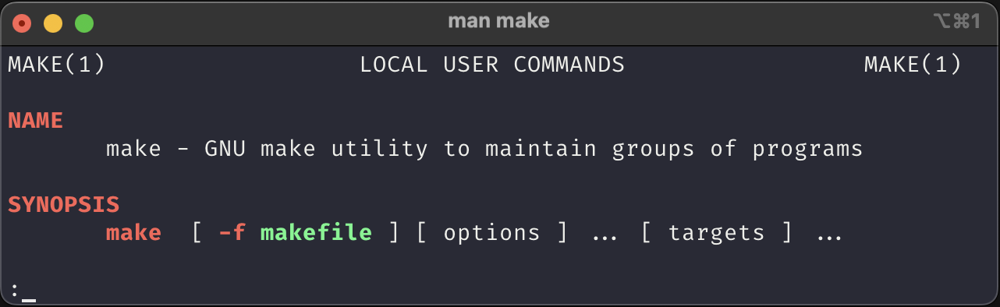

# Made


 

That is the man page for the make command.

But this repo is not about 'make'. Instead it is for listing the things that I make, physically.

I will add the design files which I either made myself or inspired by others.
Along with that, I will add how it turned out to when I made it.

Ideal structure:

``` bash
./date-made
./date-made/source # source design files
./date-made/settings # settings for the design files
./date-made/output # output of the design files
```
